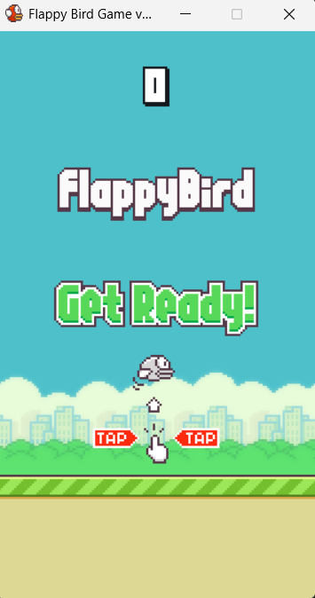
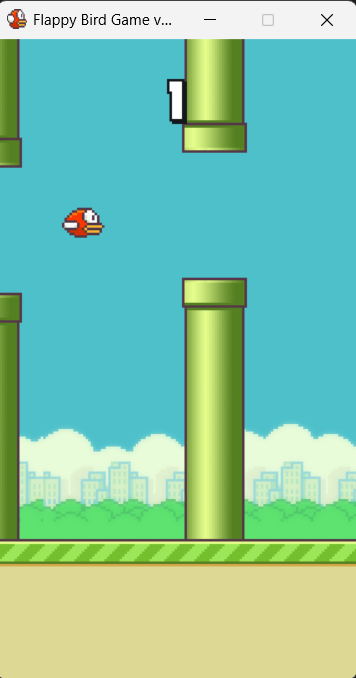

# Flappy Bird Game 🐦

An implementation of the famous arcade game **Flappy Bird**, developed to practice game loop logic, collision management, and 2D physics.

---

## 🎮 Gameplay
The goal is simple: survive for as long as possible.
* **Jump**: Press the dedicated key (usually `Spacebar` or `Mouse Click`) to defy gravity.
* **Avoid**: Do not touch the green pipes or the ground.
* **Score**: Earn one point for every pair of pipes you pass through.

## 🚀 Features
- **Realistic Physics**: Simulation of gravity and upward thrust.
- **Procedural Generation**: Pipes appear at regular intervals with variable heights.
- **Game Over State**: Quick reset system to restart the match immediately.
- **Clean Interface**: Real-time score display on the screen.




## 🛠️ Requirements and Installation

### Prerequisites
Ensure you have the following installed on your system:
* Language: **Python 3.x**
* Library: **Pygame**

### Installation
1. Clone the repository to your computer:
   ```bash
   git clone [https://github.com/buteravittorio/flappy_bird_game.git](https://github.com/buteravittorio/flappy_bird_game.git)

## ✍️ Author
- **Vittorio Butera** - [Profilo GitHub](https://github.com/buteravittorio)
